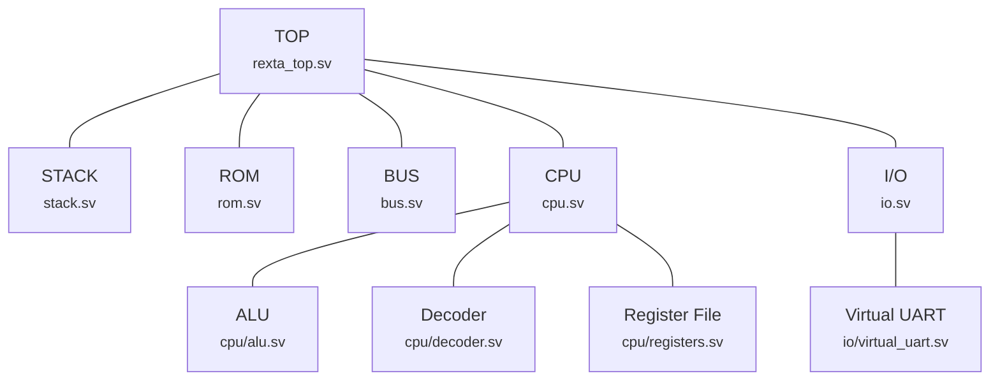

# REXTA: CPU

Rexta is a small computer which aims to be "tinkerable" like the C64s & Amigas of old, but using more modern technology.

This repository contains the Quartus project for creating the Rexta CPU on a Cyclone IV FPGA using SystemVerilog.

The Rexta CPU is effectively a RISC-V compliant SoC, with the bus handled by the chip itself.

## Requirements

### Software

- Quartus Prime Lite Edition 25.1 [Linux](https://www.intel.com/content/www/us/en/software-kit/868560/intel-quartus-prime-lite-edition-design-software-version-25-1-for-linux.html) | [Windows](https://www.intel.com/content/www/us/en/software-kit/868561/intel-quartus-prime-lite-edition-design-software-version-25-1-for-windows.html)

### Hardware

It's possible to simulate the CPU to some extent using Quartus, but to actually get a working Rexta CPU you'll need the following hardware:

- Altera Cyclone IV FPGA dev board (EP4CE6E22); the one being used for development is [this one on Amazon](https://www.amazon.co.uk/dp/B0FWQZN5GN).
- A JTAG programmer (e.g. a USB Blaster [like this one](https://www.amazon.co.uk/dp/B00ID9BAUY)).

## Getting Started

To get started, open the project (`quartus/rexta-cpu.qpf`) in Quartus. 

- You can browse the files by changing the Project Navigator to "Files".
- Compile the project by selecting "Start Compilation" from the "Processing" menu.

### Simulation

To run the simulator:

- Launch it from the "Tools" -> "Run Simulation Tool" -> "RTL Simulation" menu option.
- In the console at the bottom, `cd` to the `sim` directory in the repo.  Note that Questa likes forward-slashes in paths even on Windows:
  ```
  > cd x:/rexta/rexta-cpu/sim
  ```
- Run the `sim.do` script to run the testbench and show wave traces:
  ```
  > do sim.do
  ```  

## CPU Construction

The SystemVerilog project is composed of *modules*, which are logical 'devices' that are created on the chip.  The modules currently used are (the diagram shows where each is instantiated):



| Module        | Description                                                                 |
|---------------|-----------------------------------------------------------------------------|
| TOP           | Top-level file which groups modules together into the actual CPU.           |
| STACK         | System stack (which is stored in the FPGA's BRAM).                          |
| ROM           | Boot ROM which contains the startup code.                                   |
| BUS           | The memory map that handles assigning specific memory locations to devices. |
| CPU           | Handles the actual instruction processing.                                  |
| I/O           | Peripheral access via memory locations.                                     |
| ALU           | Handles arithmetic and bitwise operations.                                  |
| Decoder       | Decodes instructions, turning a packed instruction into a series of flags & values that tell the CPU how to execute the action. |
| Register File | Handles reading/writing the general purpose registers. |
| Virtual UART  | A peripheral that can write output to the console window when running in a simulator. |